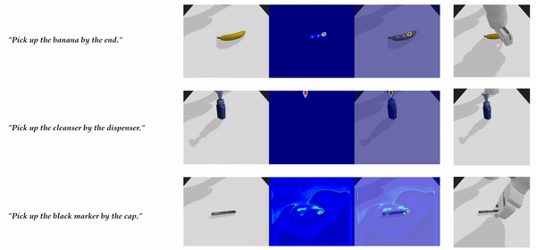

# KITE: Keypoint-Conditioned Policies for Semantic Manipulation

*Priya Sundaresan, Suneel Belkhale, Dorsa Sadigh, Jeannette Bohg*

[[Project]](http://tinyurl.com/kite-site)
[[arXiv]](https://arxiv.org/abs/2306.16605)

## Description
* KITE is a framework for semantic manipulation using keypoints as a mechanism for grounding language instructions in a visual scene, and a library of keypoint-conditioned skills for execution. This repo provides a lightweight implementation of simulated semantic grasping (grasping objects by specific object parts). 
* We leverage [ContactGraspNet](https://github.com/priyasundaresan/kite_semantic_grasping.git) as a grasping skill, and train a [CLIPort](google.com)-style model to map images and language (i.e. 'Pick up the screwdriver by the handle') to a visual keypoint. Finally, we filter grasps generated by the CGN grasp sampler to find one in close proximity to the deprojected predicted keypoint, and execute the grasp. 



## Getting Started
* Clone this repo:
```
git clone https://github.com/priyasundaresan/kite_semantic_grasping.git
```
* Go to the `docker` directory:
```
cd /path/to/kite_semanic_grasping/docker`
```
* Build the Docker image to install all dependencies:
```
./docker_build.py`
```
* After this step, run `docker images` to confirm that the image has built. You should see the following:
```
REPOSITORY            TAG       IMAGE ID       CREATED       SIZE
panda_docker_env      latest    e6200cd56f80   3 hours ago   28.4GB
```

## Running the Demo
* Go to the `docker` directory and launch a container:
```
cd /path/to/kite_semanic_grasping/docker
./docker_run.py
```
* You should now be inside the Docker container. Run the following to load all dependencies:
```
cd /host
. ./paths.sh # Equivalently, source paths.sh
pip install -e .
```
* Go to the `tasks` directory
```
cd /host/panda_gym/envs/tasks
```
* Run `python grasp.py`
* This script will drop a randomly sample object, load an example language instruction (i.e. 'Pick up the soap by the dispenser'), visualize the predicted keypoint heatmap, visualize generated grasps, and then execute the grasp nearest the predicted keypoint
* NOTE: Press `q` after visualizing the keypoint heatmap, and also after visualizing the distribution of grasp candidates, to run the episode (the visualizations are blocking)
* When done, you can exit the Docker container with `Ctrl A+D`

## Training your Own Keypoint Models
* See [here]() for the training code for KITE's keypoint module
